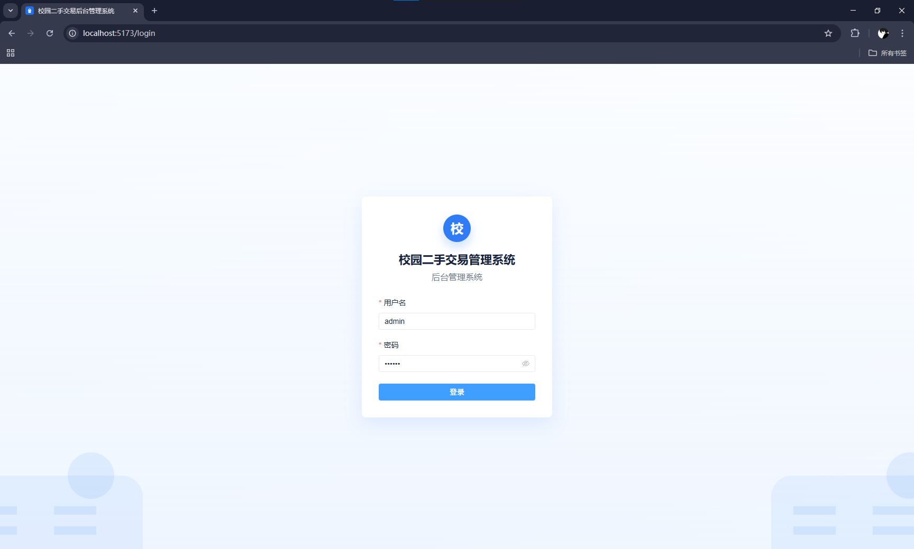
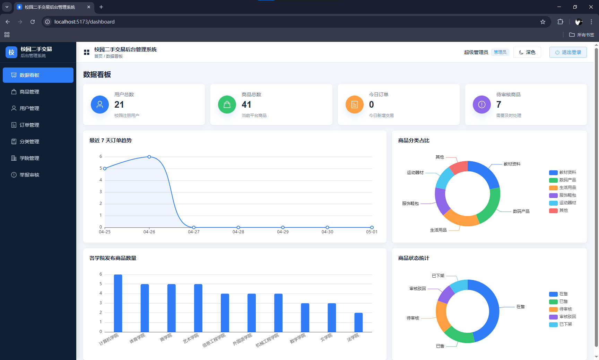
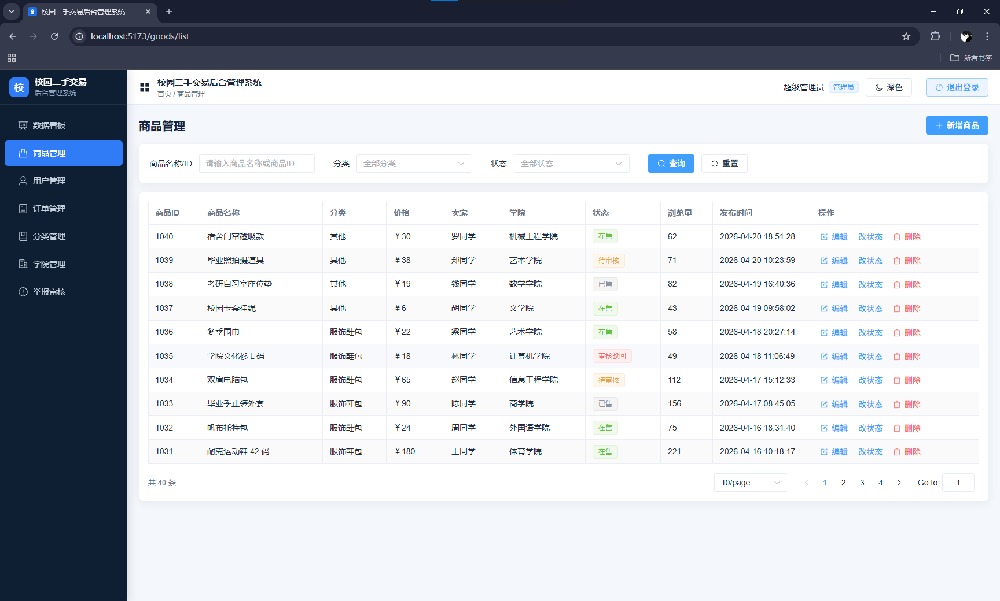
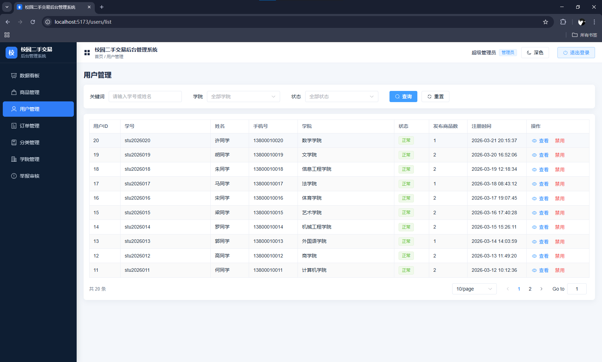
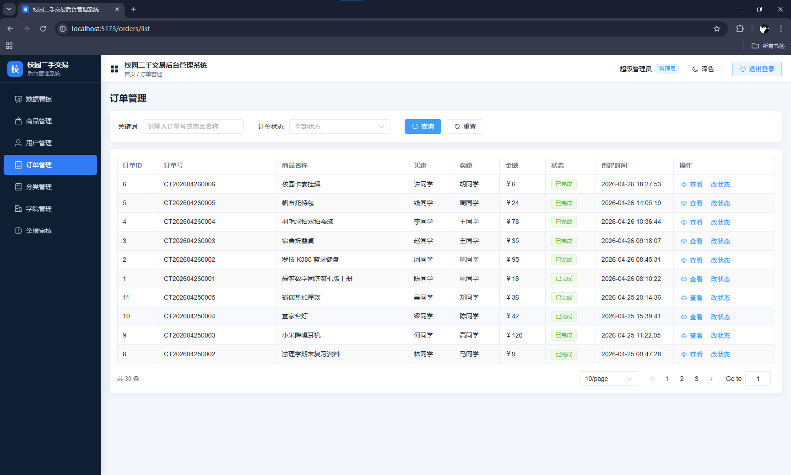
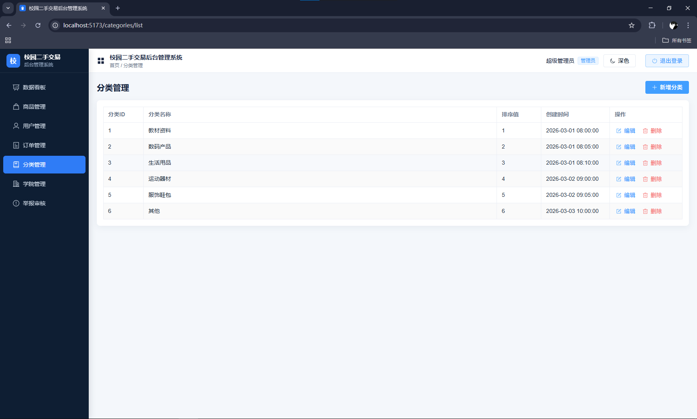
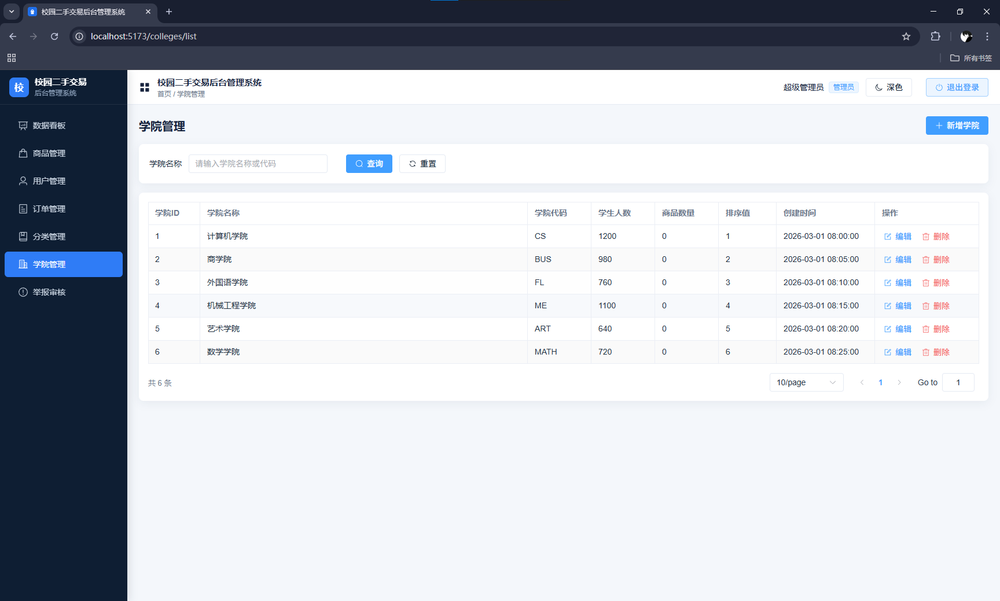
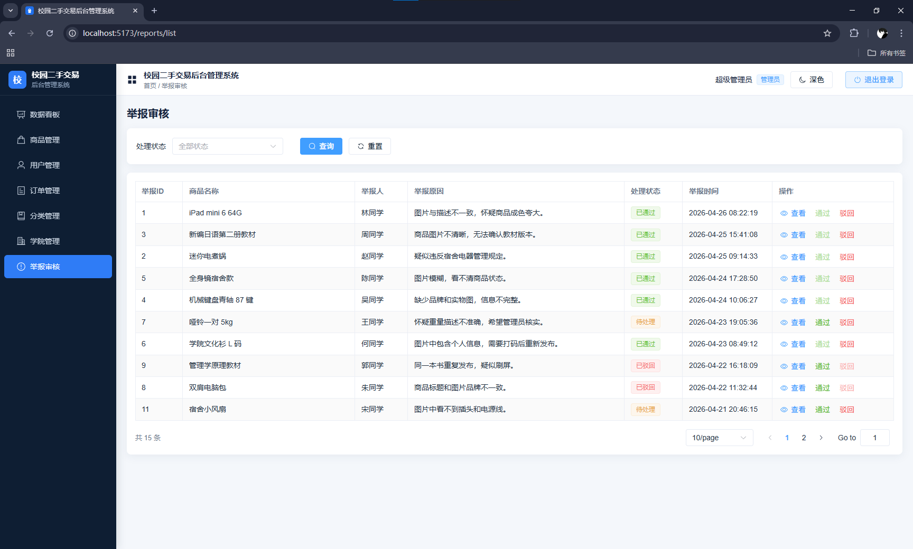

# 校园二手交易后台管理系统 / 数据看板

## 项目介绍

这是一个校园二手交易平台的后台管理系统，主要用来管理校园用户发布的二手商品、订单、分类、学院信息和举报审核数据。

项目一开始先做了前端页面和 Mock 数据，后面又接入了 Node.js + Express + MySQL，把前端页面逐步切换成真实接口。整体风格是常见后台系统：左侧菜单、顶部导航、浅灰背景、白色卡片、蓝色主按钮。

## 技术栈

前端：

- Vue3
- Vite
- Vue Router
- Pinia
- Element Plus
- ECharts
- Axios

后端：

- Node.js
- Express
- MySQL
- mysql2
- cors
- dotenv

## 功能模块

- 登录：后台账号登录，保存登录状态。
- 权限控制：区分 `admin` 和 `auditor` 两种角色。
- 数据看板：展示用户、商品、订单、审核等统计数据。
- 商品管理：商品列表、搜索、筛选、分页、新增、编辑、删除、状态修改。
- 用户管理：用户列表、搜索、筛选、分页、禁用/启用、查看详情。
- 订单管理：订单列表、搜索、筛选、分页、查看详情、状态修改。
- 分类管理：分类列表、新增、编辑、删除。
- 学院管理：学院列表、搜索、分页、新增、编辑、删除。
- 举报审核：举报列表、状态筛选、查看详情、通过、驳回。
- 异常页面：403 无权限页面、404 页面不存在页面。
- 主题切换：支持浅色和深色主题。

## 项目截图

登录页：



数据看板：



商品管理：



用户管理：



订单管理：



分类管理：



学院管理：



举报审核：



## 项目目录结构

```text
Campus Trade Admin
├─ campus-trade-admin-api        # 后端 Express 项目
│  ├─ src
│  │  ├─ config
│  │  │  └─ db.js                # MySQL 连接池
│  │  ├─ middleware
│  │  │  └─ errorHandler.js      # 全局错误处理
│  │  ├─ routes                  # 后端接口路由
│  │  │  ├─ auth.js
│  │  │  ├─ categories.js
│  │  │  ├─ colleges.js
│  │  │  ├─ dashboard.js
│  │  │  ├─ goods.js
│  │  │  ├─ orders.js
│  │  │  ├─ reports.js
│  │  │  └─ users.js
│  │  ├─ utils
│  │  │  └─ response.js          # 统一返回格式
│  │  └─ app.js                  # 后端入口
│  ├─ .env.example
│  └─ package.json
├─ database
│  ├─ schema.sql                 # 建库建表 SQL
│  └─ seed.sql                   # 测试数据 SQL
├─ public
│  └─ favicon.svg
├─ src
│  ├─ api                        # 前端接口封装
│  ├─ components                 # 公共组件
│  ├─ layout                     # 后台整体布局
│  ├─ mock                       # 版本 1 保留的 Mock 数据
│  ├─ router                     # 路由和权限守卫
│  ├─ stores                     # Pinia 状态管理
│  ├─ utils                      # 工具方法
│  ├─ views                      # 页面
│  │  ├─ categories
│  │  ├─ colleges
│  │  ├─ goods
│  │  ├─ orders
│  │  ├─ reports
│  │  └─ users
│  ├─ App.vue
│  └─ main.js
├─ .env.example                  # 前端接口地址示例
├─ index.html
├─ package.json
└─ vite.config.js
```

## 数据库设计说明

数据库名：

```text
campus_trade_admin
```

主要数据表：

- `admin_users`：后台管理员账号表，保存用户名、密码、昵称和角色。
- `students`：校园用户表，用户名按学号理解，昵称按学生姓名理解。
- `colleges`：学院表，保存学院名称、学院代码、学生人数、商品数量和排序值。
- `categories`：商品分类表，保存分类名称、排序值和商品数量。
- `goods`：商品表，保存商品名称、分类、价格、卖家、学院、状态、浏览量、描述和发布时间。
- `orders`：订单表，保存订单号、商品、买家、卖家、金额、订单状态和创建时间。
- `reports`：举报审核表，保存被举报商品、举报人、举报原因、处理状态和举报时间。

所有表都包含 `id` 主键和 `created_at` 创建时间字段，字符集使用 `utf8mb4`，方便保存中文内容。

## 后端接口说明

后端基础地址：

```text
http://localhost:3000/api
```

统一返回格式：

```json
{
  "code": 200,
  "message": "success",
  "data": {}
}
```

主要接口：

```text
POST   /api/auth/login          登录
GET    /api/auth/profile        获取当前用户信息

GET    /api/dashboard/stats     数据看板统计

GET    /api/goods               商品列表
GET    /api/goods/:id           商品详情
POST   /api/goods               新增商品
PUT    /api/goods/:id           编辑商品
DELETE /api/goods/:id           删除商品
PATCH  /api/goods/:id/status    修改商品状态

GET    /api/users               用户列表
GET    /api/users/:id           用户详情
PATCH  /api/users/:id/status    修改用户状态

GET    /api/orders              订单列表
GET    /api/orders/:id          订单详情
PATCH  /api/orders/:id/status   修改订单状态

GET    /api/categories          分类列表
POST   /api/categories          新增分类
PUT    /api/categories/:id      编辑分类
DELETE /api/categories/:id      删除分类

GET    /api/colleges            学院列表
POST   /api/colleges            新增学院
PUT    /api/colleges/:id        编辑学院
DELETE /api/colleges/:id        删除学院

GET    /api/reports             举报列表
GET    /api/reports/:id         举报详情
PATCH  /api/reports/:id/status  修改举报处理状态
```

列表接口一般支持 `page`、`pageSize`、`keyword`、`status` 等查询参数，具体参数根据页面功能有所不同。

## 本地运行步骤

### 1. 创建数据库

在 MySQL 或 Navicat 中创建数据库：

```sql
CREATE DATABASE campus_trade_admin DEFAULT CHARACTER SET utf8mb4 DEFAULT COLLATE utf8mb4_unicode_ci;
```

也可以直接执行 `database/schema.sql`，里面已经包含创建数据库的语句。

### 2. 执行 schema.sql

在 Navicat 中打开查询窗口，选择或连接 MySQL，然后执行：

```text
database/schema.sql
```

这个文件会创建项目需要的数据表。

### 3. 执行 seed.sql

继续执行：

```text
database/seed.sql
```

这个文件会插入测试账号、分类、学院、用户、商品、订单和举报数据。

可以用下面的 SQL 检查数据是否插入成功：

```sql
USE campus_trade_admin;
SELECT COUNT(*) FROM goods;
SELECT COUNT(*) FROM students;
SELECT COUNT(*) FROM orders;
```

### 4. 启动后端

进入后端目录：

```bash
cd campus-trade-admin-api
```

安装依赖：

```bash
npm install
```

复制 `.env.example` 为 `.env`，然后按自己的 MySQL 配置修改：

```env
DB_HOST=localhost
DB_PORT=3306
DB_USER=root
DB_PASSWORD=你的数据库密码
DB_NAME=campus_trade_admin
PORT=3000
```

启动后端：

```bash
npm run dev
```

浏览器访问：

```text
http://localhost:3000
```

如果看到 `Campus Trade Admin API is running`，说明后端启动成功。

### 5. 启动前端

回到项目根目录：

```bash
cd ..
```

安装依赖：

```bash
npm install
```

前端默认请求地址是：

```text
http://localhost:3000/api
```

如果需要改接口地址，可以新建 `.env`：

```env
VITE_API_BASE_URL=http://localhost:3000/api
```

启动前端：

```bash
npm run dev
```

浏览器访问：

```text
http://localhost:5173
```

生产打包：

```bash
npm run build
```

本地预览打包结果：

```bash
npm run preview
```

## 测试账号

管理员：

```text
admin / 123456
```

审核员：

```text
auditor / 123456
```

权限说明：

- `admin` 可以访问所有模块。
- `auditor` 只能访问数据看板、商品管理和举报审核。
- 未登录访问后台页面会自动跳转到登录页。
- 没有权限访问的页面会跳转到 403 页面。

## 数据看板说明

数据看板的数据来自 MySQL 聚合统计，不是页面里写死的数字。

看板内容包括：

- 用户总数
- 商品总数
- 今日订单
- 待审核商品
- 最近 7 天订单趋势折线图
- 商品分类占比图
- 各学院发布商品数量柱状图
- 商品状态统计图

因为测试数据不是每天都会更新，后端 `dashboard.js` 中加了一个演示模式开关：

```js
const USE_LATEST_ORDER_DATE_AS_TODAY = true
```

开启后，会把订单表中最新的订单日期当作“今天”，这样本地测试时图表不会因为真实日期不匹配而全是 0。真实上线时可以把它改成 `false`，改为使用 MySQL 的 `CURDATE()` 统计真实当天数据。

## 安全说明

当前项目是学生项目演示版本，主要用于本地学习、课程设计和功能展示。

目前 `admin_users` 表中的密码是明文存储，比如 `admin / 123456` 和 `auditor / 123456`，这样做是为了本地测试方便。

真实上线时不能明文保存密码。后续应该使用 `bcrypt` 对密码进行哈希加密，数据库中只保存加密后的密码哈希值。

登录接口也不应该直接用明文密码查询数据库，而应该先根据用户名查出用户信息，再使用：

```js
bcrypt.compare(用户输入的密码, 数据库中的密码哈希)
```

来判断密码是否正确。

另外，真实项目还需要继续补充 token 校验、接口权限控制、参数校验、防 SQL 注入检查、操作日志等内容。

## 后续优化方向

- 完善 JWT token 校验和接口权限控制，限制不同角色能访问的后端接口。
- 密码使用 bcrypt 加密存储。
- 后端增加更完整的参数校验。
- 后端增加角色权限中间件，限制不同角色能访问的接口。
- 商品支持图片上传。
- 表格增加批量操作。
- 数据看板增加时间范围筛选。
- 前端路由使用懒加载，减少生产包体积。
- 后端代码可以进一步拆分 controller 和 service。
- 增加操作日志，记录管理员的关键操作。
- 部署到服务器或 Netlify，并配置线上 API 地址。

## 简历项目描述

校园二手交易后台管理系统是一个基于 Vue3 + Vite 和 Node.js + Express + MySQL 的前后端分离后台管理项目。前端使用 Element Plus 搭建后台页面，使用 Vue Router 实现路由管理和角色权限控制，使用 Pinia 管理登录状态，使用 ECharts 展示数据看板。后端使用 Express 提供 RESTful 接口，通过 mysql2 连接 MySQL，实现商品、用户、订单、分类、学院和举报审核等模块的数据管理。项目支持搜索、筛选、分页、弹窗表单、状态修改、权限访问和数据统计，适合作为校园二手交易平台的后台管理端。
